# Evaluación Módulo 8 — Proyecto Serverless

**Nombre:** Jairo Morales

**Proyecto:** Proyecto Serverless

**Entorno:** AWS Academy Learner Lab

**Herramientas:** AWS CLI, AWS Management Console, Git

***Todo el código utilizado para implementar esta arquitectura se encuentra disponible en el siguiente repositorio:*** [Repositorio del proyecto.](https://github.com/donmatatan/arquitectura-serverless)

---

## 1. Situación inicial

El proyecto consistió en diseñar una alternativa para una compañía de comercio electrónico que requiere migrar un servicio a un modelo 100% serverless. El propósito de este cambio es eliminar la gestión directa de infraestructura, reducir costos operativos asociados a tiempos de inactividad y delegar el escalamiento al proveedor de nube.

Dado que el desarrollo se realizó dentro del entorno de AWS Academy Learner Lab, la arquitectura se adaptó para utilizar únicamente los servicios, configuraciones y roles IAM permitidos por la plataforma académica.

## 2. Objetivo

Implementar una aplicación funcional basada en servicios administrados de AWS, integrando almacenamiento estático, una capa de exposición de API, ejecución de lógica de negocio bajo demanda y persistencia de datos no relacional, verificando la interacción correcta entre todos los componentes.

## 3. Arquitectura de la solución

La solución implementada, denominada **Serverless Order API**, utiliza un flujo de comunicación directo entre el cliente y los servicios backend administrados.

* **Frontend:** El sitio web estático está alojado en Amazon S3.
* **API Gateway:** Funciona como punto de entrada HTTP, recibiendo las peticiones del frontend y dirigiéndolas al backend.
* **Capa de cómputo:** Dos funciones AWS Lambda escritas en Python procesan las peticiones.
* **Capa de datos:** Una tabla en Amazon DynamoDB almacena los registros de los pedidos.
* **Observabilidad:** Amazon CloudWatch Logs captura los registros de ejecución de las funciones.

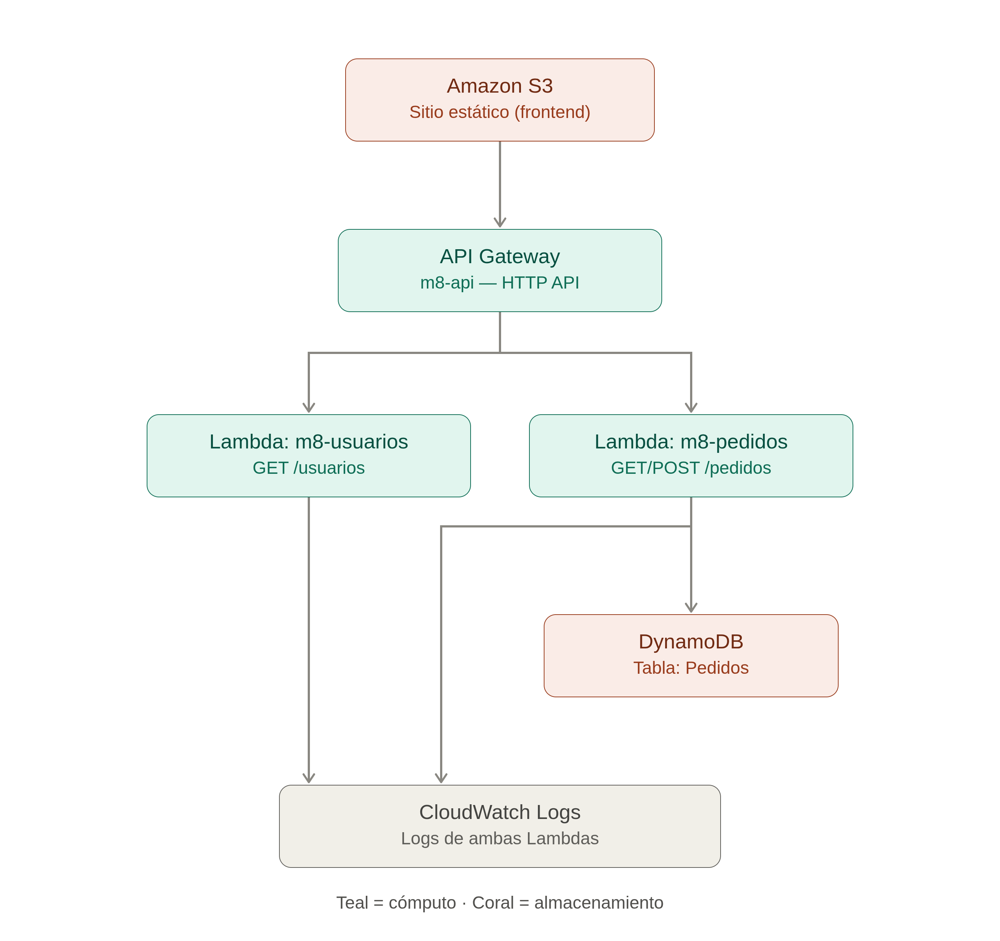
*Figura 1: Diagrama de arquitectura de la solución (S3 → API Gateway → Lambda → DynamoDB).*

La creación de los recursos se llevó a cabo mediante **AWS CLI**. Para mantener un control ordenado del entorno de laboratorio, se aplicó un esquema de etiquetado estándar a todos los componentes:

| Etiqueta | Valor |
| --- | --- |
| Project | serverless-inteligente-m8 |
| Modulo | 8 |
| Env | academy |

---

## 4. Desarrollo por lección

### Lección 1 — Sitio estático serverless

El despliegue de la interfaz de usuario se realizó configurando el bucket `m8-landing-699882359951` en Amazon S3 con la propiedad de Static Website Hosting habilitada. Aquí se alojaron los archivos `index.html`, `style.css` y `app.js`, que son definen el frontend del sitio.

El código JavaScript de la aplicación está configurado para consumir los endpoints públicos de la API. Las peticiones recuperan la lista de usuarios, consultan el historial de pedidos e insertan nuevos registros directamente desde el navegador.

***URL del sitio web:*** [Sitio web.](https://github.com/donmatatan/arquitectura-serverless)

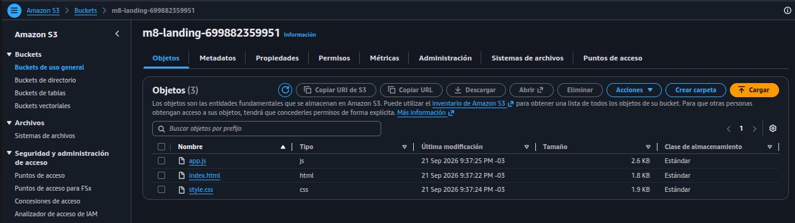
*Figura 2: Bucket m8-landing para hosting en la consola de S3.*

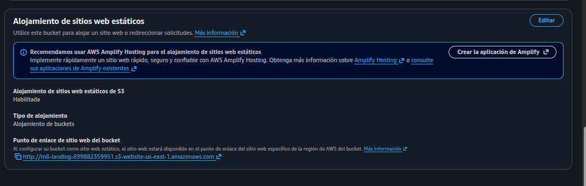
*Figura 3: Opción de "Static website hosting" habilitado en el bucket m8-landing.*

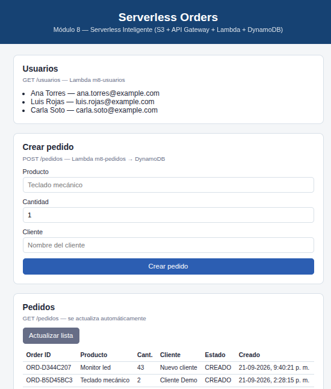{width=75%}
*Figura 4: Página cargada desde la URL de S3, mostrando usuarios y pedidos obtenidos desde la API.*

### Lección 2 — Funciones como servicio (Lambda)

La lógica de negocio se estructuró en dos funciones Lambda utilizando el runtime de Python 3.12 y el rol de ejecución `LabRole`, el cual dispone de los permisos necesarios para interactuar con DynamoDB y emitir registros a CloudWatch dentro de las restricciones de AWS Academy.

- **`m8-usuarios`**: responde `GET /usuarios` con un mensaje de saludo y un listado de usuarios.
- **`m8-pedidos`**: responde `GET /pedidos` (lista los últimos pedidos desde DynamoDB) y `POST /pedidos` (valida los datos, genera un `orderId` único y guarda el pedido en la tabla `Pedidos`).

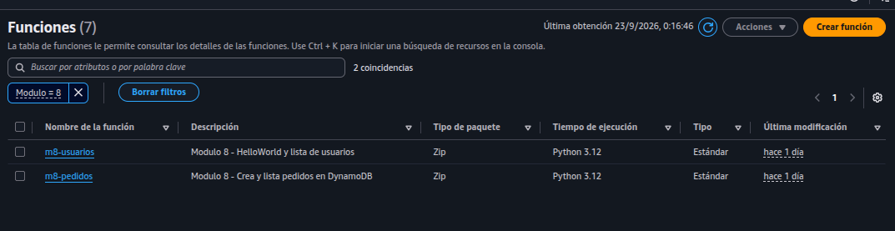
*Figura 5: Consola de Lambda mostrando m8-usuarios y m8-pedidos.*

Se validó el código de ambas funciones utilizando eventos de prueba configurados directamente en la consola de AWS Lambda, emulando la estructura del payload que entrega API Gateway (`requestContext`, `body`, etc.). Estas pruebas se demuestran en las siguientes imágenes:

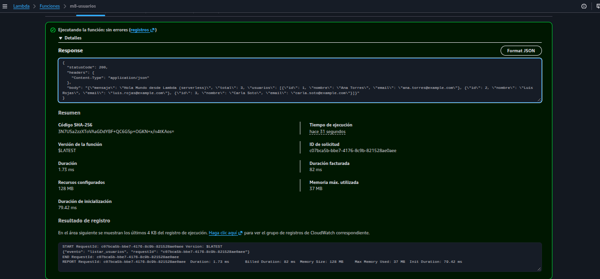
*Figura 6: Resultado de la ejecución de prueba de m8-usuarios (statusCode 200 y el JSON de usuarios).*

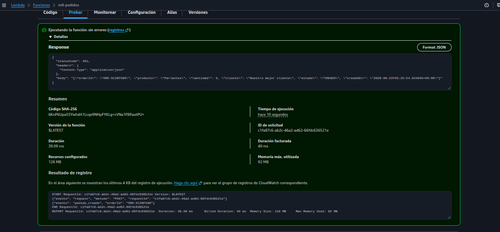
*Figura 7: Resultado de la ejecución de prueba de m8-pedidos, insertando un pedido.*

### Lección 3 — API Gateway

Para la exposición de las funciones, se implementó una HTTP API (`m8-api`) configurada con integración proxy Lambda. Se establecieron las siguientes rutas para direccionar el tráfico:

| Método | Ruta | Integración |
| --- | --- | --- |
| GET | /usuarios | m8-usuarios |
| GET | /pedidos | m8-pedidos |
| POST | /pedidos | m8-pedidos |

El despliegue se realizó en el stage `$default` con auto-deploy. Un paso necesario en esta etapa fue la configuración de CORS, permitiendo peticiones desde cualquier origen (`*`) para asegurar que el frontend alojado en el dominio de S3 pudiera comunicarse con la API sin que el navegador bloqueara la solicitud.

URL de la API: https://m0jy5dgszk.execute-api.us-east-1.amazonaws.com

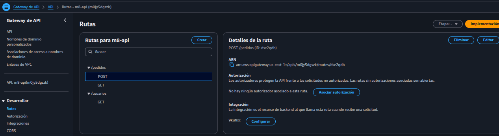
*Figura 8: API Gateway y Rutas implementadas*

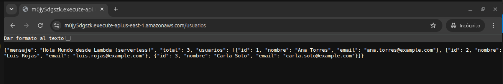
*Figura 9: Respuesta de `GET /usuarios` abierta directamente en el navegador.*

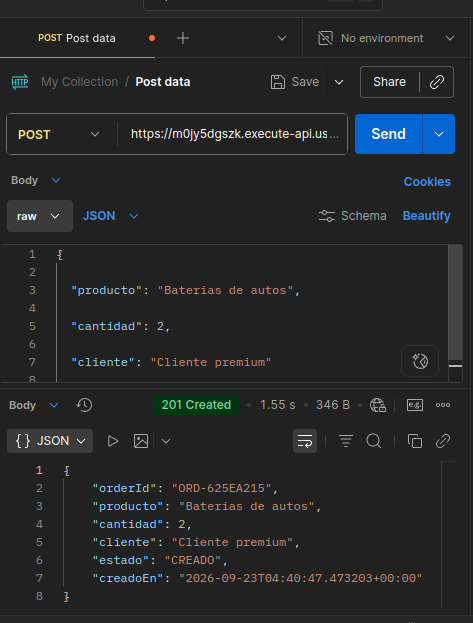{width=75%}
*Figura 10: Petición POST /pedidos en Postman, con el pedido creado como respuesta (201).*

### Lección 4 — Persistencia con DynamoDB

La persistencia de datos se resolvió mediante Amazon DynamoDB. Se creó la tabla `Pedidos` definiendo el atributo `orderId` (String) como clave de partición.

Para acoplar la base de datos al modelo serverless, se seleccionó el modo de capacidad bajo demanda (`PAY_PER_REQUEST`). Esta configuración evita la necesidad de aprovisionar unidades de lectura y escritura por adelantado, delegando a AWS la adaptación frente a variaciones en la cantidad de peticiones.

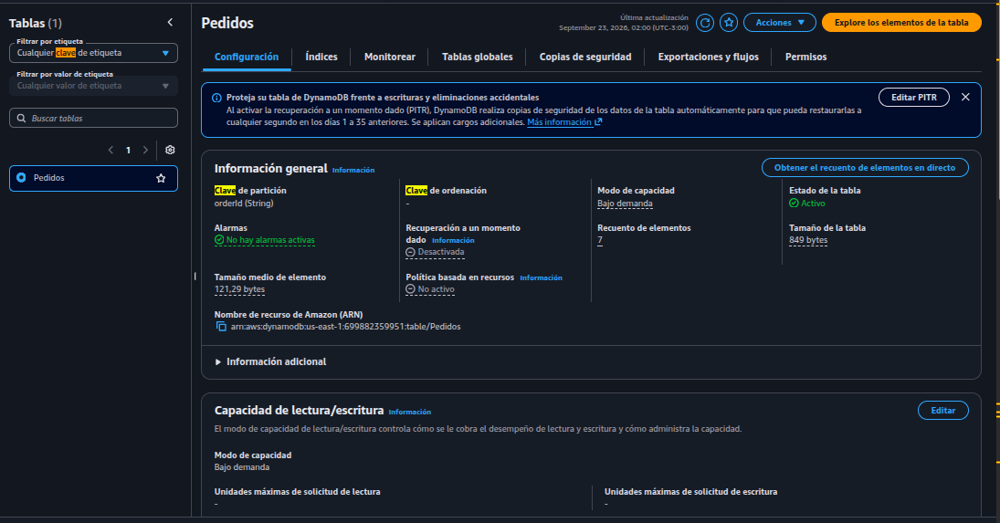
*Figura 11: Consola de DynamoDB mostrando la tabla Pedidos y su clave de partición.*

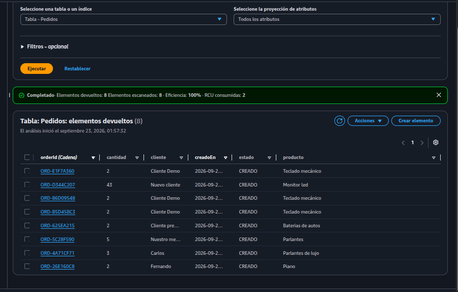
*Figura 12: Explorador de ítems de la tabla Pedidos con los pedidos creados durante las pruebas.*

### Lección 5 — Monitoreo y documentación

La observabilidad de la solución se verificó en Amazon CloudWatch. Al ejecutar las pruebas, se comprobó la generación automática de los log groups correspondientes (`/aws/lambda/m8-usuarios` y `/aws/lambda/m8-pedidos`).

Además de los registros estándar de consumo de memoria y tiempo de ejecución, se evidenciaron las trazas personalizadas programadas en el código Python (como la generación del evento `pedido_creado`), las cuales facilitan el seguimiento de los datos procesados en cada petición.

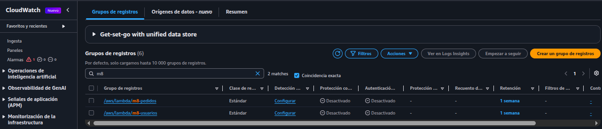
*Figura 13: CloudWatch → Log groups, filtrado por /aws/lambda/m8-.*

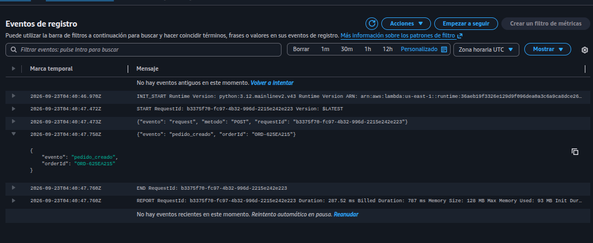
*Figura 14: Log stream de una invocación de m8-pedidos, mostrando el evento pedido_creado y el orderId generado.*

---

## 5. ¿Qué se validó?

La implementación cumplió con todos los requerimientos técnicos solicitados:

* [x] Aplicación serverless con funciones Lambda expuestas mediante API Gateway.
* [x] Sitio estático alojado en S3 y comunicándose correctamente con la API.
* [x] Base de datos DynamoDB recibiendo inserciones desde la función Lambda.
* [x] Trazabilidad confirmada mediante la inspección de logs en CloudWatch.
* [x] Documentación técnica respaldada con evidencias y diagrama de arquitectura.

**Resumen de pruebas funcionales ejecutadas:**

* `GET /usuarios`: Código HTTP 200, retornó el listado estático JSON.
* `POST /pedidos`: Código HTTP 201, generó la inserción en base de datos.
* `GET /pedidos`: Código HTTP 200, recuperó correctamente los ítems desde DynamoDB.

---

## 6. Conclusiones y aprendizajes

A partir de la construcción de esta arquitectura, destaco varios puntos sobre el trabajo con servicios administrados:

La ausencia de administración de infraestructura cambia por completo la forma de enfocar el despliegue. Durante todo el proyecto no tuve que configurar sistemas operativos ni configurar ni desplegar servidores web activos; el enfoque estuvo íntegramente en el código de las funciones y en cómo conectar los servicios mediante permisos y algunas configuraciones de red, como fue el caso de CORS en API Gateway.

Si tuviera que evolucionar este proyecto para un entorno productivo real, mi prioridad sería agregar una capa de autenticación, integrando Amazon Cognito en API Gateway para proteger las rutas. También implementaría validaciones de datos más estrictas en el backend antes de realizar el `put_item` en DynamoDB y definiría alarmas de facturación y de errores en CloudWatch para mantener un control activo sobre la salud del sistema.
